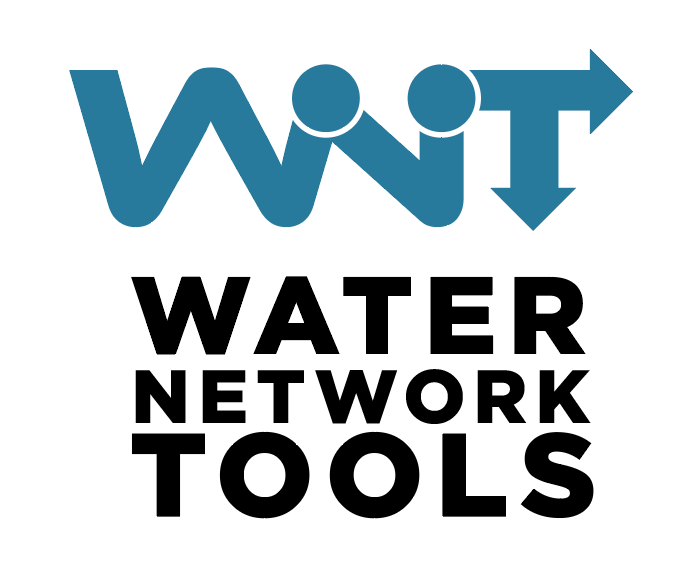

<p align="center"></p>

# Water Network Tools (WNT)

Water Network Tools is a QGIS Processing plugin for creating, editing, validating, importing and exporting pressurized water network data. It works with WNT node and link layers, EPANET `.inp` model files, EPANET scenario files, WNT XML, LandXML 1.2 pipe networks, LandXML TIN surfaces and pipe-sizing inputs.

Requires QGIS 3.38 or later.

## Recipes

Each bullet below is a WNT Processing algorithm. The text after the algorithm name summarizes the workflow it covers.

### Build

Available process:

- `Network from lines` - Builds EPANET-style node and link layers from CAD/GIS line features. It supports multipart lines, endpoint merging by tolerance, node elevations from zero values, line Z values, DEM rasters or one selected LandXML TIN surface, and optional node degree/topology fields.

### Demand

Available processes:

- `Assign demand` - Assigns one or more demand fields from source features to the nearest network nodes and creates assignment lines.
- `Connect by distance` - Connects source and target features by nearest distance, with optional limits for number of connections and maximum distance.
- `Update assignment` - Recalculates demand assignments after manually editing assignment lines.

### Export

Available processes:

- `Network to epanet file (.inp)` - Writes an EPANET model from WNT node and link layers. It can merge the selected network into an existing `.inp` model or create a new model from the internal EPANET template, validating the final graph before writing.
- `Demand to epanet scenario file (.scn)` - Writes an EPANET demand scenario from a selected node demand field.
- `Pipe properties to EPANET scenario file (.scn)` - Writes an EPANET pipe scenario with diameter and roughness values for pipe links.
- `Network to XML` - Writes WNT Network XML with versioned network data and preserved EPANET, SWMM, LandXML and custom property domains, or writes a LandXML 1.2 pipe-network file.
- `Network to pipesizing data file (.pro)` - Writes pipesizing input data with `[SETTINGS]`, `[PRESSURES]`, `[FIRE_SCENARIOS]` and `[PIPES]` sections, including peak/fire factors, required pressures and optional hydrant-pair fire scenarios.
- `Network to pressure pipe optimization data file (.ext)` - Writes PPNO (`Pressurized Pipe Network Optimizer`) input data from network layers, an EPANET `.inp` model and a pipe catalog `.cat` file. See https://github.com/andresgciamtez/ppno.

### Fire

Available process:

- `Hydrant pairs` - Generates hydrant pairs/calculation scenarios from a hydrant layer, excluding pairs farther apart than the maximum separation. The output can be used by the pipesizing `.pro` exporter as fire scenarios.

### Graph

Available processes:

- `Classify` - Classifies links as branched or meshed and assigns a globally unique `zone`.
- `Node degrees` - Calculates the graph degree of each network node.
- `Network to graph file` - Exports the network topology to Trivial Graph Format (TGF).
- `Validate` - Reports orphan nodes, duplicate nodes, duplicate links, links with undefined endpoints and loops.

### Import

Available processes:

- `Configure EPANET lib` - Sets the EPANET toolkit library path used by EPANET result imports.
  Configure only a trusted EPANET 2 toolkit library installed on your system.
- `Network from EPANET file` - Imports EPANET `.inp` files as WNT node and link layers.
- `Results from EPANET` - Imports hydraulic results, quality results or both from EPANET simulations.
- `Network from XML` - Imports WNT Network XML files, including selected network versions, or imports LandXML 1.2 pipe networks as WNT node and link layers.

### Modify

Available processes:

- `Node elevation from DEM` - Adds or updates node elevations from a DEM raster.
- `Node elevation from TIN (LandXML)` - Adds or updates node elevations from one selected LandXML TIN surface.
- `Split lines at points` - Splits line features at point positions.
- `Merge networks` - Merges two networks and validates the final graph before creating output layers.

## Packaging

Run from an activated development environment:

```bash
python package_wnt.py
```

Andr乶 Garc眼 Mart暗ez (ppnoptimizer@gmail.com)

===

# Water Network Tools (WNT)

Water Network Tools es un plugin de QGIS Processing para crear, editar, validar, importar y exportar datos de redes de agua a presi칩n. Trabaja con capas WNT de nodos y links, archivos de modelo EPANET `.inp`, archivos de escenario EPANET, XML de WNT, redes de tuber칤as LandXML 1.2, superficies TIN LandXML y datos para dimensionamiento de tuber칤as.

Requiere QGIS 3.38 o posterior.

## Recetas

Cada vi침eta siguiente es un algoritmo de WNT en Processing. El texto posterior al nombre del algoritmo resume el flujo de trabajo que cubre.

### Construir

Proceso disponible:

- `Red desde l칤neas` - Genera capas de nodos y links con estructura EPANET a partir de l칤neas CAD/GIS. Soporta l칤neas multipart, fusi칩n de extremos por tolerancia, elevaciones de nodo desde valores cero, valores Z de l칤nea, r치steres MDE o una superficie TIN LandXML seleccionada, y campos opcionales de grado/topolog칤a.

### Demanda

Procesos disponibles:

- `Asignar demanda` - Asigna uno o varios campos de demanda desde entidades de origen a los nodos de red m치s cercanos y crea l칤neas de asignaci칩n.
- `Conectar por distancia` - Conecta entidades de origen y destino por distancia m칤nima, con l칤mites opcionales de n칰mero de conexiones y distancia m치xima.
- `Actualizar asignaci칩n` - Recalcula asignaciones de demanda despu칠s de editar manualmente las l칤neas de asignaci칩n.

### Exportar

Procesos disponibles:

- `Red a archivo EPANET (.inp)` - Escribe un modelo EPANET desde capas WNT de nodos y links. Puede fusionar la red seleccionada con un modelo `.inp` existente o crear un modelo nuevo desde la plantilla interna de EPANET, validando el grafo final antes de escribir.
- `Demanda a archivo de escenario de EPANET (.scn)` - Escribe un escenario EPANET de demandas desde un campo de demanda de nodos seleccionado.
- `Propiedades de tuber칤as a archivo de escenario de EPANET (.scn)` - Escribe un escenario EPANET de tuber칤as con valores de di치metro y rugosidad para links de tipo tuber칤a.
- `Red a XML` - Escribe WNT Network XML con datos de red versionados y conserva dominios de propiedades EPANET, SWMM, LandXML y personalizados, o escribe una red de tuber칤as LandXML 1.2.
- `Red a archivo de datos pipesizing (.pro)` - Escribe datos de entrada para pipesizing con secciones `[SETTINGS]`, `[PRESSURES]`, `[FIRE_SCENARIOS]` y `[PIPES]`, incluyendo factores punta/incendio, presiones requeridas y escenarios opcionales de incendio a partir de pares de hidrantes.
- `Red a archivo de datos para optimizaci칩n de tuber칤as a presi칩n (.ext)` - Escribe datos de entrada para PPNO (`Pressurized Pipe Network Optimizer`) desde capas de red, un modelo EPANET `.inp` y un cat치logo de tuber칤as `.cat`. Consulta https://github.com/andresgciamtez/ppno.

### Incendio

Proceso disponible:

- `Pares de hidrantes` - Genera pares de hidrantes/escenarios de c치lculo desde una capa de hidrantes, excluyendo pares separados por una distancia mayor que la separaci칩n m치xima. La salida puede usarse como escenarios de incendio en el exportador pipesizing `.pro`.

### Grafo

Procesos disponibles:

- `Clasificar` - Clasifica links como ramificados o mallados y asigna un `zone` globalmente 칰nico.
- `Grados de nodo` - Calcula el grado de grafo de cada nodo de la red.
- `Red a archivo de grafo` - Exporta la topolog칤a de la red a Trivial Graph Format (TGF).
- `Validar` - Informa nodos hu칠rfanos, nodos duplicados, links duplicados, links con extremos no definidos y bucles.

### Importar

Procesos disponibles:

- `Configurar biblioteca EPANET` - Define la ruta de la biblioteca del toolkit de EPANET usada para importar resultados EPANET.
  Configura 칰nicamente una biblioteca de confianza del toolkit EPANET 2 instalada en el sistema.
- `Red desde archivo de EPANET` - Importa archivos EPANET `.inp` como capas WNT de nodos y links.
- `Resultados de EPANET` - Importa resultados hidr치ulicos, resultados de calidad o ambos desde simulaciones EPANET.
- `Red desde XML` - Importa archivos WNT Network XML, incluidas versiones de red seleccionadas, o importa redes de tuber칤as LandXML 1.2 como capas WNT de nodos y links.

### Modificar

Procesos disponibles:

- `Elevaci칩n de nodos desde MDE` - A침ade o actualiza elevaciones de nodos desde un r치ster MDE.
- `Elevaci칩n de nodos desde TIN (LandXML)` - A침ade o actualiza elevaciones de nodos desde una superficie TIN LandXML seleccionada.
- `Dividir l칤neas en puntos` - Divide entidades de l칤nea en posiciones de puntos.
- `Fusionar redes` - Fusiona dos redes y valida el grafo final antes de crear las capas de salida.

## Empaquetado

Ejecutar desde un entorno de desarrollo activo:

```bash
python package_wnt.py
```

Andr乶 Garc眼 Mart暗ez (ppnoptimizer@gmail.com)
